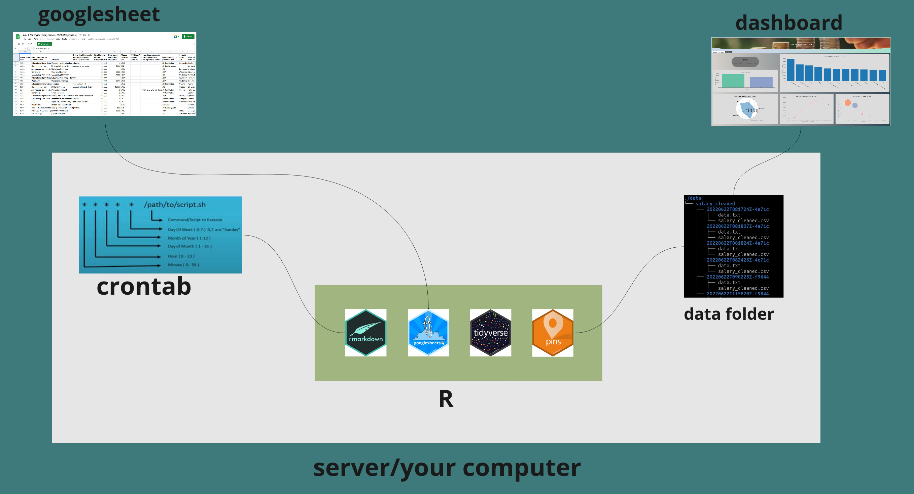

# ETL pipeline: scenario 1   



There are different ways of how your ETL pipeline could look like and this largely depends on how you access your data, process it and the use of it. 
In this article I'll be handling a scenario where the data is being fetched from a googlesheet, processed in an rmarkdown script and used on a shiny dashboard.  

Both the datapreprocessing_script and the app scripts have access to the data folder. So what happens is, the markdown script preprocesses the data and outputs the tidy data into the data folder, the shiny app on the other end takes up the tidy data.   

There is this data that I have been working and done articles on. It is an ongoing survey on salary, the data is collected into a googlesheet and the submissions are done spontaneously. Consider checking out my earlier articles on the data.   
After wrangling the data and developing a dashboard for analysis, I thought of a way to update the dashboard with the latest data submissions without necessarily having to run the rmarkdown script manually. 

**Enter cron job !**      

A cron job is a unix(linux/mac) system utility program that can be used to automate recurring jobs. I'll assume you have an idea on that, if not, I suppose then you might need to consider learning some basics from [this](https://linuxhandbook.com/crontab/) article.   

**Note: This works in a linux/mac set up, for windows consider task scheduler.**      

Seeing that the data submissions are done spontenously, we can set up a cron job that runs the rmarkdown script hourly,daily,weekly,monthly etc depending on your use case. 
The use cases will differ from context to context, for example, we might have a case where data is streaming in by minutes/seconds, daily or even monthly. As such, you will write a cron job that updates your data as per the frequency of data submission.    

**Note: there are R packages for scheduling cron jobs [cronR](https://github.com/bnosac/cronR) for Unix and [taskscheduleR](https://github.com/bnosac/taskscheduleR) for windows.**     


## Scheduling a Cron job 

Run the below command to open a crontab  

```
$ crontab -e 
```

A script will open, after that enter the below line into the script 


```
* * * * * Rscript -e "rmarkdown::render('~/path/to/your/script.Rmd')"
```

_Note: Do remember to edit the path to your rmarkdown script accordingly._     

The above cron job will run every minute, you can edit it so as to run as you would the script be executed.  

You might run into a problem of accessing pandoc when executing the Rmd script from the commandline.   

**Error: pandoc version 1.12.3 or higher is required and was not found (see the help page ?rmarkdown::pandoc_available).
Execution halted._**  


Like for my case the location of pandoc was inside quarto, so I had to specify the location on the .Renviron variable.  

To do that: 
  - Go to your RStudio and run : 
    | Sys.getenv("RSTUDIO_PANDOC") 
  
  - Open the .Renviron file using (usethis::edit_r_environ()) and specify the location of your pandoc as: 
    | RSTUDIO_PANDOC=/the/path/as/you/got/it/up/there/


## Accessing data from googlesheets4   

With [googlesheets4](https://github.com/tidyverse/googlesheets4) package we can fetch the data from google sheets using a url. 
You will howerver need to deactivate authentication using gs4_deauth() function so that we're not prompted to enter an access token every time the script fetches data.  
Remember our intention is to automate the entire process of data import, wrangling to visualization/storage hence no need to authenticate.  

## Data wrangling

At this point now we have our data in R, we can now wrangle it as desired. 
The [tidyverse](https://github.com/tidyverse/tidyverse) library would come in handy at this point. With it we can access functions for use in cleaning and transforming our data as desired so that we can have a tidy data as an output which can be imported into a shiny app for example or used in modelling.  


## Versioning your data   
Once we have our data in a tidy format, we can version it using the [pins](https://pins.rstudio.com/) packages. 
You might be wondering why we should version our data, well, imagine of a scenario where you want to roll back to a certain state of your data, then pins package would be your go to for, with it, you can version your data hence giving you the option of fetching a specific version depending on the situation. But by default, the latest version is the one fetched.   

If you'd like to play around with the workflow the repo can be accessed [here](https://github.com/oyogo/ETL_pipeline)    

References:  

1. [Automated survey reporting](https://www.rstudio.com/blog/automated-survey-reporting/)   


