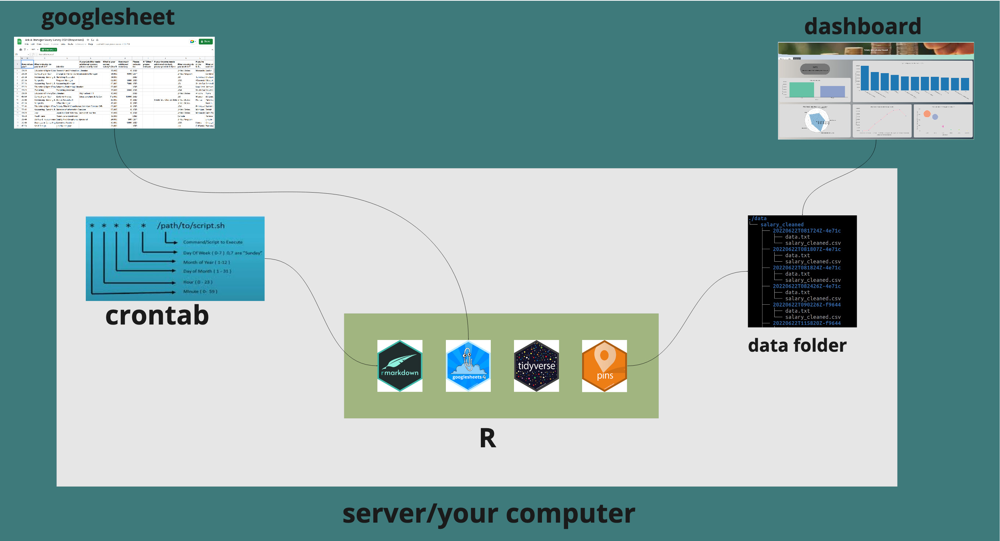

# ETL pipeline: scenario 1   



There are different ways of how your ETL pipeline could look like and this largely depends on how you access your data, process it and the use of it. 
In this article I'll be handling a scenario where the data is being fetched from a googlesheet, processed in an rmarkdown script and used on a shiny dashboard.  

In this context, both the data preprocessing script and the shiny app scripts have access to the data folder. So what happens is, the markdown script preprocesses the data and outputs the tidy data into the data folder, the shiny app on the other end takes up the tidy data.   

There is this data that I have been working and done articles on. It is an ongoing survey on salary, the data is collected into a googlesheet and the submissions are done spontaneously. Consider checking out my earlier articles on the data.   
After wrangling the data and developing a dashboard for analysis, I thought of a way to update the dashboard with the latest data submissions without necessarily having to run the rmarkdown script manually. 

**Enter cron job !**      

A cron job is a unix(linux/mac) system utility program that can be used to automate recurring jobs. I'll assume you have an idea on that, if not, I suppose then you might need to consider learning some basics from [this](https://linuxhandbook.com/crontab/) article.   

**Note: This works in a linux/mac set up, for windows consider task scheduler.**      

Seeing that the data submissions are done spontenously, we can set up a cron job that runs the rmarkdown script hourly,daily,weekly,monthly etc depending on your use case. 
The use cases will differ from context to context, for example, we might have a case where data is streaming in by minutes/seconds, daily or even monthly. As such, you will write a cron job that updates your data as per the frequency of data submission.    

_Note: there are R packages for scheduling cron jobs [cronR](https://github.com/bnosac/cronR) for Unix and [taskscheduleR](https://github.com/bnosac/taskscheduleR) for windows, in case you want it easy :) that is, as for me, I chose to do the scripting._   


## Scheduling a Cron job 

Run the below command to open a crontab  

```
$ crontab -e 
```

A script will open, after that enter the below line into the script and save. 


```
* * * * * Rscript -e "rmarkdown::render('~/path/to/your/script.Rmd')"
```

_Note: Do remember to edit the path to your rmarkdown script accordingly._     

The above cron job will run every minute, you can edit it so as to run as you would the script be executed.  


## This section is a by-the-way :)   
I had a problem of accessing pandoc when executing the Rmd script from the commandline. 

**Error: pandoc version 1.12.3 or higher is required and was not found (see the help page ?rmarkdown::pandoc_available).
Execution halted._**  

Like for my case the location of pandoc was inside quarto, so I had to specify the location on the .Renviron variable.  

To do that: 
  - Go to your RStudio and run : 
    | Sys.getenv("RSTUDIO_PANDOC") 
  
  - Open the .Renviron file using (usethis::edit_r_environ()) and specify the location of your pandoc as: 
    | RSTUDIO_PANDOC=/the/path/as/you/got/it/up/there/


## Accessing data from googlesheets4   

With [googlesheets4](https://github.com/tidyverse/googlesheets4) package we can fetch the data from google sheets using a url. 
You will howerver need to deactivate authentication using gs4_deauth() function so that we're not prompted to enter an access token every time the script fetches data.  
Remember our intention is to automate the entire process of data import, wrangling to visualization/storage hence no need to authenticate.  

```
gs4_deauth() # this deactivates authentication. We won't be prompted to login using credentials.

salary_data <- read_sheet("https://docs.google.com/spreadsheets/d/1IPS5dBSGtwYVbjsfbaMCYIWnOuRmJcbequohNxCyGVw/edit?resourcekey#gid=1625408792")
salary_data <- data.table::setDT(salary_data)
```

## Data wrangling

At this point now we have our data in R, we can now wrangle it as desired. 
The [tidyverse](https://github.com/tidyverse/tidyverse) library would come in handy at this point. With it we can access functions for use in cleaning and transforming our data as desired so that we can have a tidy data as an output which can be imported into a shiny app for example or used in modelling.  
The Datacleaning.Rmd file on the repo has all the cleaning and transformation steps. 

```
# change the columns name - observe the naming syntax for headers/columns
 names(salary_data) <- c("Timestamp","age","industry","job_title","job_title_context","annual_salary",
                         "Other_monetary_comp","currency","currency_other",
                         "income_context","country","state","city","professional_experience_years","field_experience_years",
                         "highest_edu_level","gender","race")
                         
                         
# College degree and Some college kinda means the same. Let us just categorize them into one (College degree). 
salary_data$highest_edu_level <- gsub("Some college","College degree",salary_data$highest_edu_level)


# replace the variants of United states with one name.  
salary_data$country <- stri_replace_all_regex(salary_data$country,
                                  pattern=c('US', 'USA', 'usa',"U.S.","us","Usa","United States of America","united states",
                                            "U.S>","U.S.A","U.S.A.","united states of america","Us","The United States",
                                            "United State of America","United Stated","u.s.","UNITED STATES","united States","USA-- Virgin Islands",
                                            "United Statws","U.S","Unites States","U. S.","United Sates","United States of American","Uniited States",
                                            "Worldwide (based in US but short term trips aroudn the world)","United Sates of America",
                                            "Unted States","United Statesp","United Stattes","United Statea","United Statees","UNited States","Uniyed states",
                                            "Uniyes States","United States of Americas","US of A","United States of america","U.SA","United Status","U.s.",
                                            "U.s.a.","USS","Uniteed States","United Stares","Unites states","Unite States","The US","United states of America",
                                            "For the United States government, but posted overseas","UnitedStates","United statew","United Statues",
                                            "Untied States","USA (company is based in a US territory, I work remote)","Unitied States","Unitied States",
                                            "USAB","United Sttes","united stated","United States Of America","Uniter Statez","U. S","USA tomorrow",
                                            "United Stateds","US govt employee overseas, country withheld","Unitef Stated","United STates","USaa",
                                            "uSA","america","United y","uS","USD","United Statss","UsA","United  States","United States is America",
                                            "United states of United States","United StatesD","United States- Puerto Rico","United Statesaa","United Statest",
                                            "United States govt employee overseas, country withheld","United StatesA tomorrow","United StatesAB",
                                            "United StatesA (company is based in a United States territory, I work remote)","United StatesS",
                                            "United Statesa.","RUnited Statessia","United States of A","United StatesA-- Virgin Islands","United StatesA.",
                                            "United State","United states","United StatesA","United Statess","United StatessA","United States",
                                            "United Statessmerica","United StatUnited Statess","Canada and United StatessA","United States"),
                                  replacement="United States",
                                  vectorize=FALSE)
                                  
                                  
# use gsub to remove the A from states. 
salary_data$country <- gsub("United StatesA","United States",salary_data$country)

# do the grouping and count the records by the country column 
percentage.count <- salary_data[,.(totalcount=.N,country)][,.(count=.N,totalcount,country),by=.(country)][,.(percentage=round(count/totalcount*100)),by=.(count,country)] %>% unique()


salary_data_US <- salary_data[country %like% "United States",]


# for column currency replace other with USD where currency_other == USD
# data.table approach to replacing values in a column based on a condition in another column. 

salary_data_US <- salary_data_US[currency_other %in% c("USD","American Dollars","US Dollar"), currency := "USD"]

# There are alternative approaches to this, like using case_when with mutate or if_else with mutate. 
# You could explore such options just to have the knowledge of the alternatives. 


salary_data_US <- salary_data_US[currency == "USD",]

# if you wanna check if the currency is USD only you could do uncomment and run the following lines of code.  
#unique(salary_data_US$currency)  


# convert annual_salary to numerical data type. 
salary_data_US$annual_salary <- gsub(",","",salary_data_US$annual_salary)
salary_data_US$annual_salary <- as.numeric(salary_data_US$annual_salary) 


# we have some values which are null. we drop them  
salary_data_US <- salary_data_US[ highest_edu_level !="",]  

# remove the NA
salary_data_US <- salary_data_US[!is.na(annual_salary),]  

# for the gender variable, let us only pick the male and female groupings 
salary_data_US <- salary_data_US[gender %in% c("Man","Woman")]
salary_data_US$gender <- as.factor(salary_data_US$gender) 


# subset the dataset 
salary_data_US <- salary_data_US[,c("age","annual_salary","professional_experience_years","highest_edu_level","gender","industry","job_title")]   


                         
```

## Storage/Versioning your data   
Once we have our data in a tidy format, we can store and version it using the [pins](https://pins.rstudio.com/) packages. 
You might be wondering why we should version our data, well, imagine of a scenario where you want to roll back to a certain state of your data, then pins package would be your go to, for, with it, you can version your data hence giving you the option of fetching a specific version depending on the situation. But by default, the latest version is the one fetched.   


```
# create a board
board <- board_folder("./data",versioned = TRUE)

board %>% pin_write(salary_data_US,"salary_cleaned", type="csv")

```


## Using the data    

The cleaned data can be fetched by a shiny dashboard, stored in a database for future use or even be further used in modelling. 
For this context we have a dashboard accessing the data.    

  


If you'd like to play around with the workflow the repo can be accessed [here](https://github.com/oyogo/ETL_pipeline)    

**Next article !**   

I am working on scenario 2 of an R - ETL pipeline, a case where we have a data submission platform (R Shiny app) which, upon data submission to the server, triggers a bash script that in turn runs the pipeline and then the analysis dashboard consumes the tidy data.   


References:  

1. [Automated survey reporting](https://www.rstudio.com/blog/automated-survey-reporting/)   


